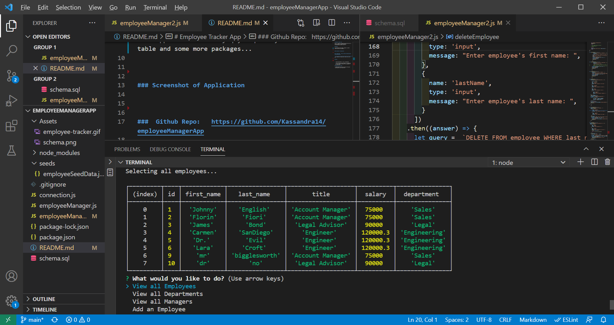

# Employee Tracker App

This is a simple CLI application that allows you to read and update an employee database.
This application allows a user to:

### Usage

This application uses mysql, inquirer, console table and some more packages...

### Screenshot of Application

###  Github Repo:   https://github.com/Kassandra14/employeeManagerApp

### Demonstration Video:

 A video demonstrating the entirety of the app's functionality can be found here:
 
 \employeeManagerApp\employeeManagerApp.webm

